# Image Captioning (Show, Attend and Tell)
## 설명
Flickr8k의 데이터를 바탕으로 image captioning 모델을 훈련합니다.
본 코드에서는 [Show, Attend and Tell](https://arxiv.org/pdf/1502.03044.pdf) 논문에서 소개한 image captioning 모델을 제작합니다.
이 논문에 대한 설명은 [Image Captioning (Show, Attend and Tell)](https://ljm565.github.io/contents/img2txt1.html) 글을 참고하시기 바랍니다.
또한 본 코드의 attention은 논문에서 소개한 soft attention으로 제작 되었습니다.
모델 초기화를 위해 Show, Attend and Tell 논문 구현의 유명한 PyTorch 코드인 [PyTorch Tutorial to Image Captioning](https://github.com/sgrvinod/a-PyTorch-Tutorial-to-Image-Captioning)의 모델 initialization을 참고하였습니다.
그리고 위 튜토리얼에서 사용한 길이별로 sorting하여 decoding 하는 방법은 비효율적이라 판단하여, 한 번에 max length를 모두 decoding 하는 방법으로 모델을 훈련하였습니다.
마지막으로 원래의 논문에서 소개한 Tanh를 이용하는 Bahdanau attention 기반의 soft attention을 구현하였습니다(시간이 된다면 hard attention과 beam search 코드도 추가할 예정입니다).
<br><br><br>

## 모델 종류
* Image Encoder: ResNet-101
* Caption Decoder: LSTM
* Attention: Soft Attention (Bahdanau Attention)
<br><br><br>


## 토크나이저 종류
* ### Word Tokenizer
    단어 기준으로 토큰화(Attention 가시화를 위함).
<br><br><br>

## 사용 데이터
* [Flickr8k](https://www.kaggle.com/datasets/adityajn105/flickr8k)
    <br>여기서 나와있는 data_sample은 전체 데이터가 아닌 일부 sample 데이터입니다. 전체 데이터는 위 링크에서 받을 수 있습니다.
    만약 코드가 돌아가는지 확인하기 위해서는 아래 명령어를 먼저 실행해서 데이터 폴더 이름을 변경해야합니다.
    ```
    mv data_sample data
    ```
<br><br><br>


## 사용 방법
* ### 학습 방법
    학습을 시작하기 위한 argument는 4가지가 있습니다.<br>
    * [-d --device] {cpu, gpu}, **필수**: 학습을 cpu, gpu로 할건지 정하는 인자입니다.
    * [-m --mode] {train, test, inference}, **필수**: 학습을 시작하려면 train, 최종 학습된 모델을 가지고 있어서 loss, BLEU 등 모델의 성능 지표를 확인하고 싶다면 test로 설정해야합니다. 학습된 모델을 바탕으로 랜덤 이미지에 대해 캡션을 생성하고, attention 영역을 확인하고 싶다면 inference로 설정해야합니다(결과는 result 폴더에 생성 됩니다). test, inference 모드를 사용할 경우, [-n, --name] 인자가 **필수**입니다.
    * [-c --cont] {1}, **선택**: 학습이 중간에 종료가 된 경우 다시 저장된 모델의 체크포인트 부분부터 학습을 시작할 수 있습니다. 이 인자를 사용할 경우 -m train 이어야 합니다. 
    * [-n --name] {name}, **선택**: 이 인자는 -c 1 혹은 -m {test, inference} 경우 사용합니다.
    중간에 다시 불러서 학습을 할 경우 모델의 이름을 입력하고, test, inference를 할 경우에도 확인할 모델의 이름을 입력해주어야 합니다(최초 학습시 config.json에서 정한 모델의 이름의 폴더가 형성되고 그 폴더 내부에 모델 및 모델 파라미터가 json 파일로 형성 됩니다).<br><br>

    터미널 명령어 예시<br>
    * 최초 학습 시
        ```
        python3 main.py -d cpu -m train
        ```
    * 중간에 중단 된 모델 이어서 학습 시
        <br>주의사항: config.json을 수정해야하는 일이 발생 한다면 base_path/config.json이 아닌, base_path/model/{model_name}/{model_name}.json 파일을 수정해야 합니다.
        ```
        python3 main.py -d gpu -m train -c 1 -n {model_name}
        ```
    * 최종 학습 된 모델의 test set에 대한 loss, BLEU 등의 결과를 확인할 시
        <br>주의사항: config.json을 수정해야하는 일이 발생 한다면 base_path/config.json이 아닌, base_path/model/{model_name}/{model_name}.json 파일을 수정해야 수정사항이 반영됩니다.
        ```
        python3 main.py -d cpu -m test -n {model_name}
        ```
    * 최종 학습 된 모델의 test set에 대한 랜덤 이미지의 캡션 생성 결과 및 attention 영역을 확이할 시
        <br>주의사항: config.json을 수정해야하는 일이 발생 한다면 base_path/config.json이 아닌, base_path/model/{model_name}/{model_name}.json 파일을 수정해야 수정사항이 반영됩니다.
        ```
        python3 main.py -d cpu -m inference -n {model_name}
        ```
    <br><br>

* ### 모델 학습 조건 설정 (config.json)
    **주의사항: 최초 학습 시 config.json이 사용되며, 이미 한 번 학습을 한 모델에 대하여 parameter를 바꾸고싶다면 base_path/model/{model_name}/{model_name}.json 파일을 수정해야 합니다.**
    * is_attn: {0, 1} 중 선택. Attention 모델을 제작한다면 1, 아니면 0. 
    * base_path: 학습 관련 파일이 저장될 위치.
    * model_name: 학습 모델이 저장될 파일 이름 설정. 모델은 base_path/model/{model_name}/{model_name}.pt 로 저장.
    * loss_data_name: 학습 시 발생한 loss data를 저장하기 위한 이름 설정. base_path/loss/{loss_data_name}.pkl 파일로 저장. 내부에 중단된 학습을 다시 시작할 때, 학습 과정에 발생한 loss 데이터를 그릴 때 등 필요한 데이터를 dictionary 형태로 저장.
    * img_size: 이미지 전처리할 크기.
    * enc_hidden_size: Encoder 결과의 마지막 feature의 height, width 크기.
    * vocab_size: 최대 vocab size 설정.
    * max_len: 토큰화 된 캡션 데이터의 최대 길이.
    * dec_hidden_size: Decoder의 hidden dimension.
    * dec_num_layers: Decoder 모델의 레이어 수.
    * dropout: Decoder의 dropout 비율.
    * batch_size: batch size 지정.
    * epochs: 학습 epoch 설정.
    * enc_lr: Encoder fine-tuning을 위한 learning rate 지정.
    * dec_lr: Decoder learning rate 지정.
    * regularization_lambda: Regularization loss term 계수 지정.
    * result_num: 모델 inference 시, 결과를 보여주는 sample 개수.
    * topk: 모델 학습 시, Top-k accuracy 결과를 보여줄 k 값.
    * early_stop_criterion: Validation set의 최대 BLEU-4를 내어준 학습 epoch 대비, 설정된 숫자만큼 epoch이 지나도 나아지지 않을 경우 학습 조기 종료.
    <br><br><br>


## 결과
* ### Image Captioning 모델 훈련 결과
    아래 그래프와 표기된 결과는 teacher forcing으로 확인한 결과입니다.
    Inference 방식으로 계산된 loss 및 score를 보고싶다면 inference mode로 실행 시 자동 계산 되므로 확인할 수 있습니다.
    * Loss History<br>
        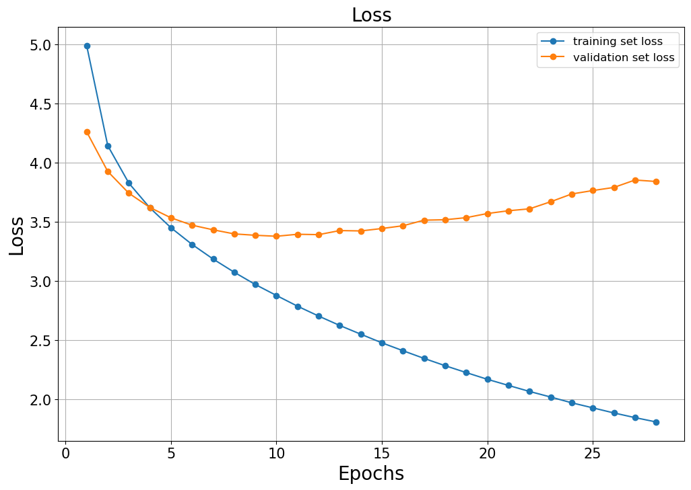<br><br>

    * Validation Set BLEU<br>
        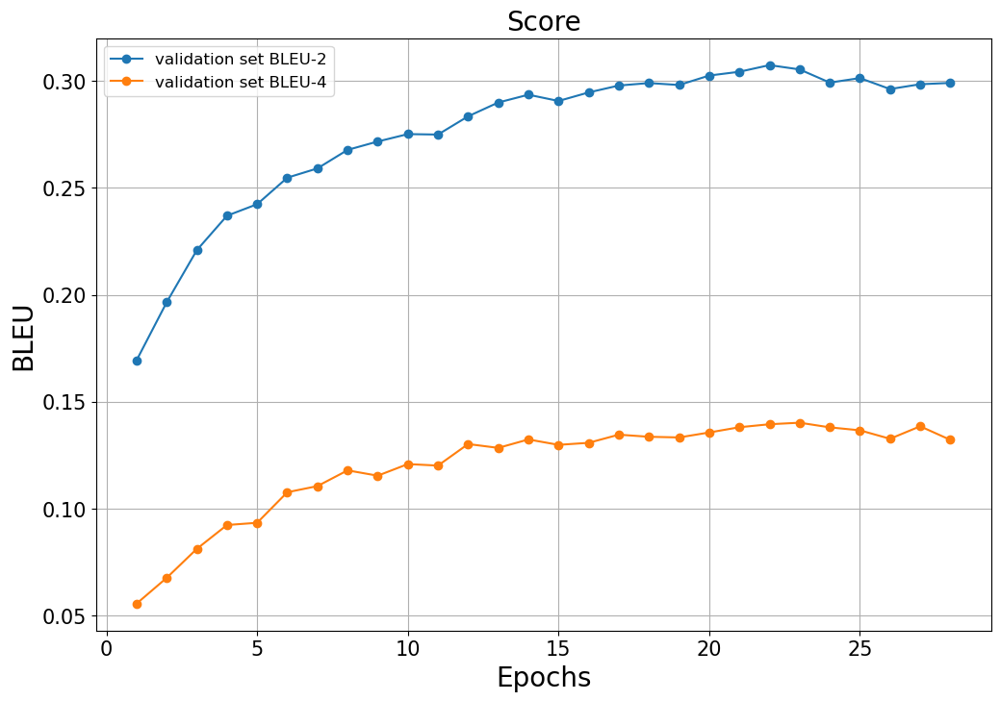<br>
        * Best BLEU-2: 0.3053 (22 epoch)
        * Best BLEU-4: 0.1402 (23 epoch), BLEU-4 기준으로 best model 저장.
        <br><br>

    * Validation Set NIST<br>
        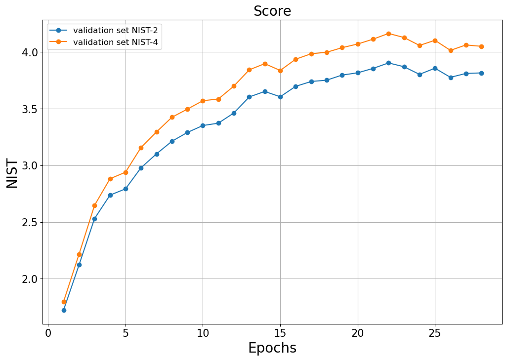<br>
        * Best NIST-2: 3.9032 (22 epoch)
        * Best NIST-4: 4.1633 (22 epoch)
        <br><br>

    * Validation Set Top-5 Accuracy<br>
        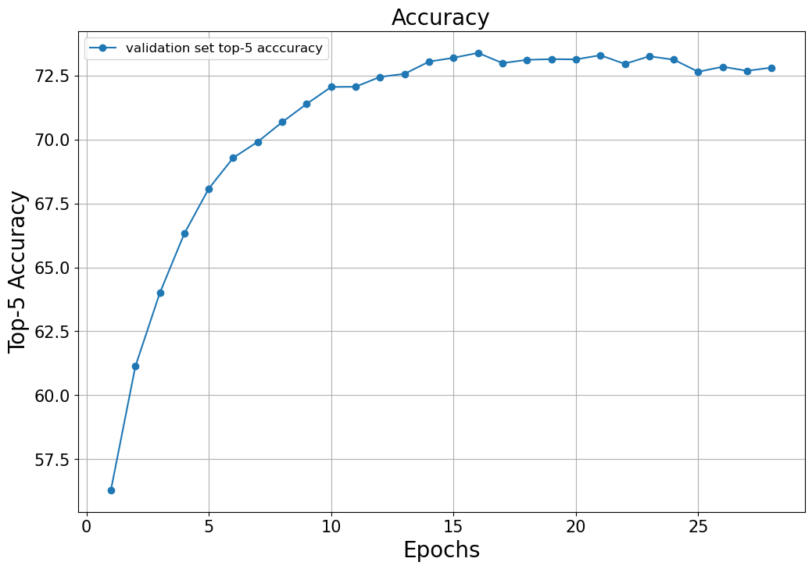<br>
        * Best top-5 accuracy: 73.3850 (16 epoch)
        <br><br>


    * 캡션 생성 샘플(더 많은 결과는 result 폴더 참고)<br>
        Inference로 확인한 결과입니다.
        * Sample 1
        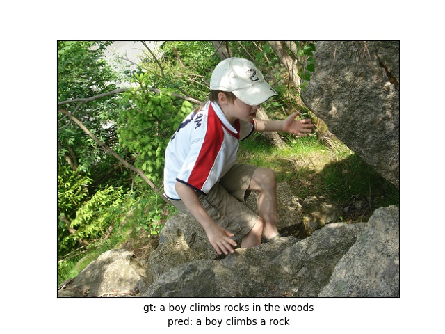<br>
        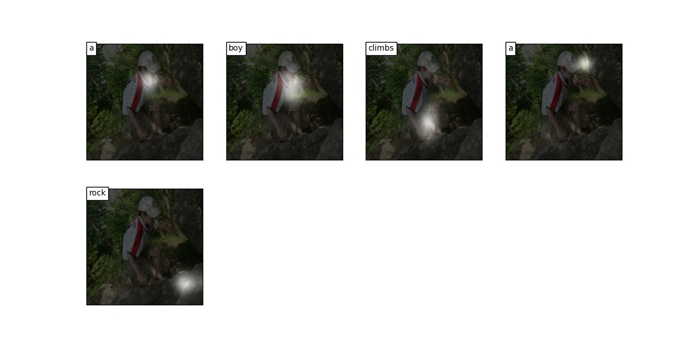<br>
        <br><br>

        * Sample 2
        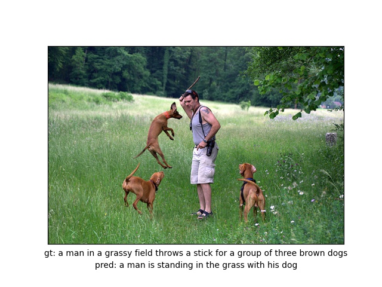<br>
        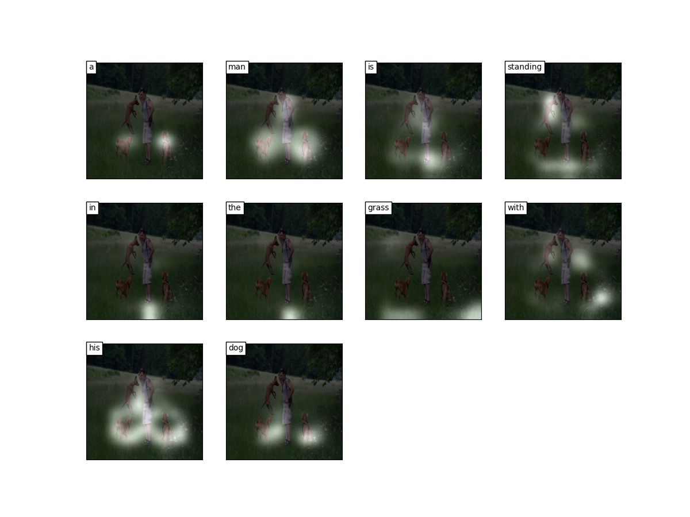<br>
        <br><br>

        * Sample 3
        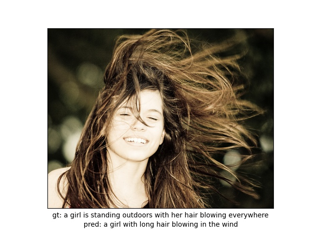<br>
        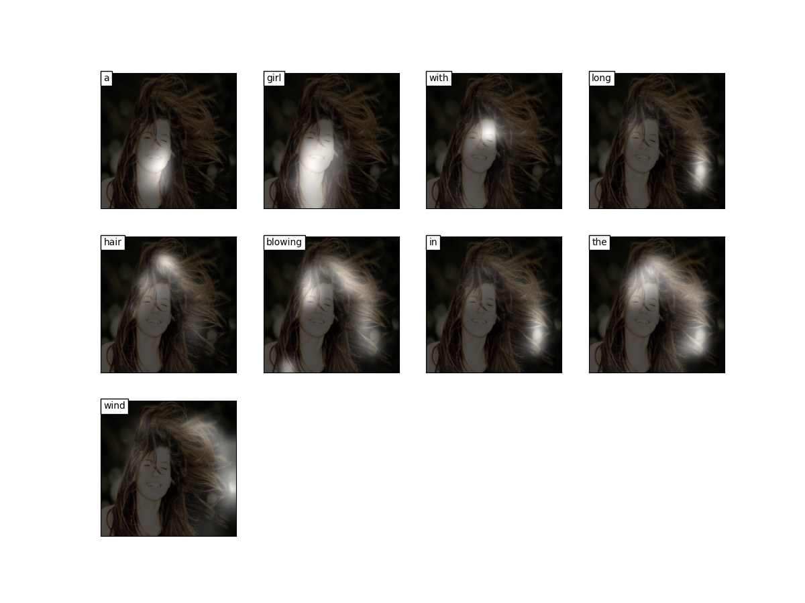<br>
        <br><br>

        * Sample 4
        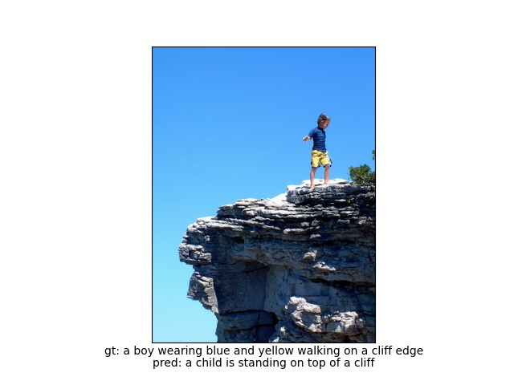<br>
        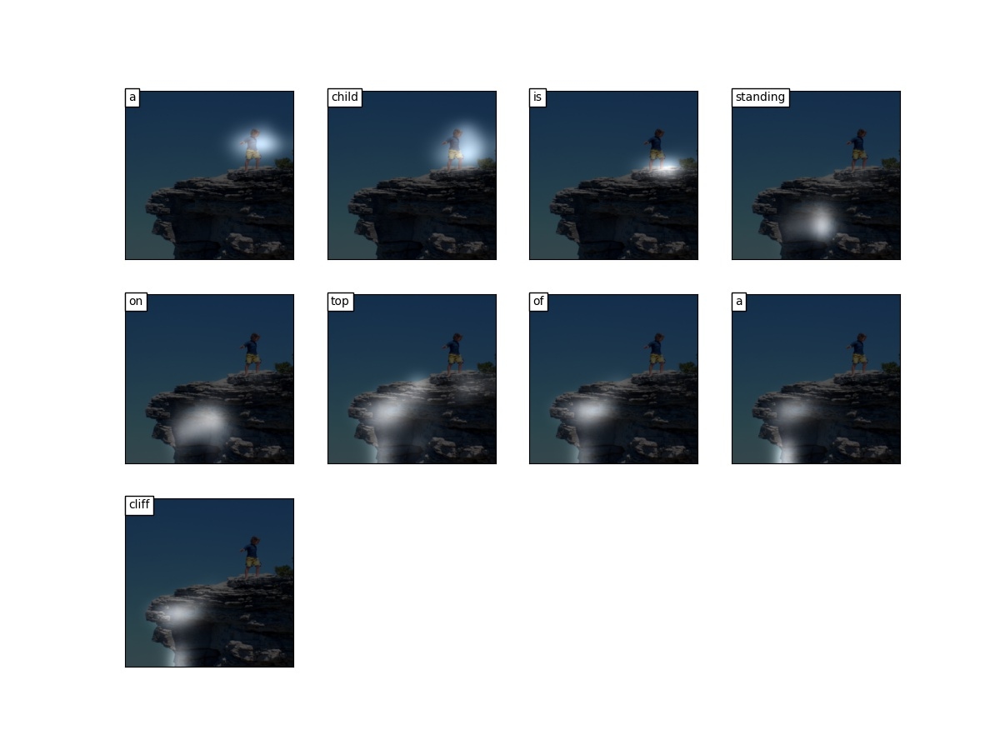<br>
        <br><br>

         * Sample 5
        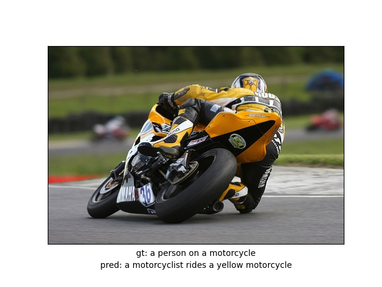<br>
        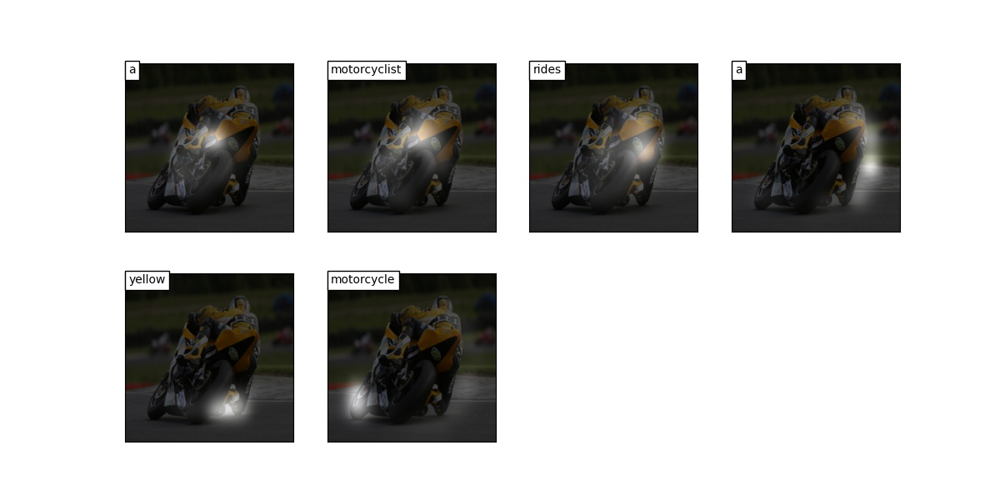<br>
        <br><br>
        

<br><br><br>
