# Image Captioning (Show, Attend and Tell)

## Introduction
[Flickr8k](https://www.kaggle.com/datasets/adityajn105/flickr8k) 데이터를 바탕으로 image captioning 모델을 훈련합니다.
본 코드에서는 [Show, Attend and Tell](https://arxiv.org/pdf/1502.03044.pdf) 논문에서 소개한 image captioning 모델을 제작합니다.
이 논문에 대한 설명은 [Image Captioning (Show, Attend and Tell)](https://ljm565.github.io/contents/img2txt1.html) 글을 참고하시기 바랍니다.
또한 본 코드의 attention은 논문에서 소개한 soft attention으로 제작 되었습니다.
모델 초기화를 위해 Show, Attend and Tell 논문 구현의 유명한 PyTorch 코드인 [PyTorch Tutorial to Image Captioning](https://github.com/sgrvinod/a-PyTorch-Tutorial-to-Image-Captioning)의 모델 initialization을 참고하였습니다.
그리고 위 튜토리얼에서 사용한 길이별로 sorting하여 decoding 하는 방법은 비효율적이라 판단하여, 한 번에 max length를 모두 decoding 하는 방법으로 모델을 훈련하였습니다.
마지막으로 원래의 논문에서 소개한 Tanh를 이용하는 Bahdanau attention 기반의 soft attention을 구현하였습니다(시간이 된다면 hard attention과 beam search 코드도 추가할 예정입니다).
<br><br><br>

## Supported Models
* Image Encoder: ResNet-101
* Caption Decoder: LSTM
* Attention: Soft Attention (Bahdanau Attention)
<br><br><br>

## Supported Tokenizer
### Custom Word Tokenizer
* 단어 기준으로 토큰화(Attention 가시화를 위함).
<br><br><br>

## Base Dataset
* [Flickr8k](https://www.kaggle.com/datasets/adityajn105/flickr8k)을 가지고 튜토리얼을 진행합니다.
여기서 나와있는 data_sample은 전체 데이터가 아닌 일부 sample 데이터입니다. 전체 데이터는 위 링크에서 받을 수 있습니다.
만약 코드가 돌아가는지 확인하기 위해서는 아래 명령어를 먼저 실행해서 데이터 폴더 이름을 변경해야합니다.
    ```bash
    mv data_sample data
    ```
* Custom 데이터를 사용하기 위해서는 `config/config.yaml`에 데이터셋 경로를 주어줘야합니다.
Custom 데이터셋을 사용한다면, `src/trainer/build.py`파일에 코드를 추가해주어야합니다.
<br><br><br>

## Supported Devices
* CPU, GPU, multi-GPU (DDP), MPS (for Mac and torch>=1.12.0)
<br><br><br>

## Quick Start
```bash
python3 src/run/train.py --config config/config.yaml --mode train
```
<br><br>

## Project Tree
본 레포지토리는 아래와 같은 구조로 구성됩니다.
```
├── configs                           <- Config 파일들을 저장하는 폴더
│   └── *.yaml
│
└── src      
    ├── models
    |   ├── decoder.py                <- Decoder model 파일
    |   ├── encoder.py                <- Encoder model 파일
    |   └── modules.py                <- Decoder와 encoder에서 사용되는 modules 파일
    |
    ├── run                   
    |   ├── train.py                  <- 학습 실행 파일
    |   ├── validation.py             <- 학습된 모델 평가 실행 파일
    |   └── vis_attention.py          <- 단어별 attention 가시화 코드
    |
    ├── tools                   
    |   ├── tokenizers
    |   |    └── tokenizer.py         <- 단어기반 토크나이저 파일
    |   |
    |   ├── early_stopper.py          <- Early stopper class 파일
    |   ├── evaluator.py              <- Metric evaluator class 파일
    |   ├── model_manager.py          
    |   └── training_logger.py        <- Training logger class 파일
    |
    ├── trainer                 
    |   ├── build.py                  <- Dataset, dataloader 등을 정의하는 파일
    |   └── trainer.py                <- 학습, 평가 등을 수행하는 class 파일
    |
    └── uitls                   
        ├── __init__.py               <- Logger, 버전 등을 초기화 하는 파일
        ├── data_utils.py             <- Custom dataloader 파일
        ├── filesys_utils.py       
        ├── func_utils.py       
        └── training_utils.py     
```
<br><br>


## Tutorials & Documentations
이미지 캡셔닝 모델 학습을 위해서 다음 과정을 따라주시기 바랍니다.
1. [Getting Started](./1_getting_started_ko.md)
2. [Data Preparation](./docs/2_data_preparation.md)
3. [Training](./docs/3_trainig.md)
4. ETC
   * [Evaluation](./docs/4_model_evaluation.md)
   * [Attention Visualization](./docs/5_vis_attn.md)
   * [Print Sentiment Prediction Results](./docs/6_pred_sentiment.md)

<br><br><br>

## Training Results
### Image Captioning Training Results
* Loss History<br>
    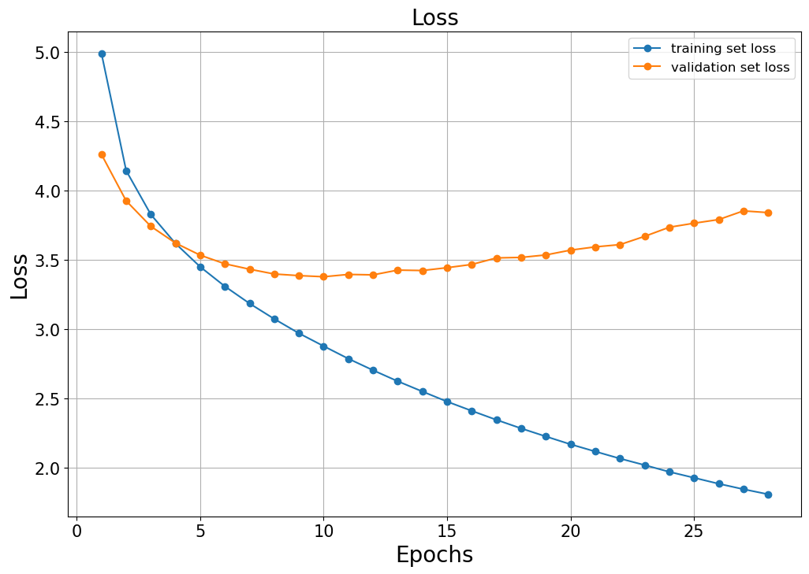<br><br>

* Validation Set BLEU<br>
    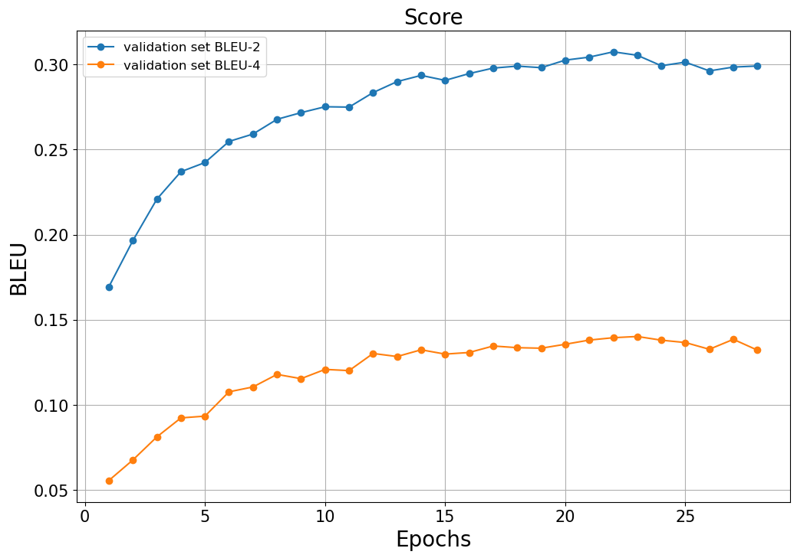<br>
    * Best BLEU-2: 0.3053 (22 epoch)
    * Best BLEU-4: 0.1402 (23 epoch)
    <br><br>

* Validation Set NIST<br>
    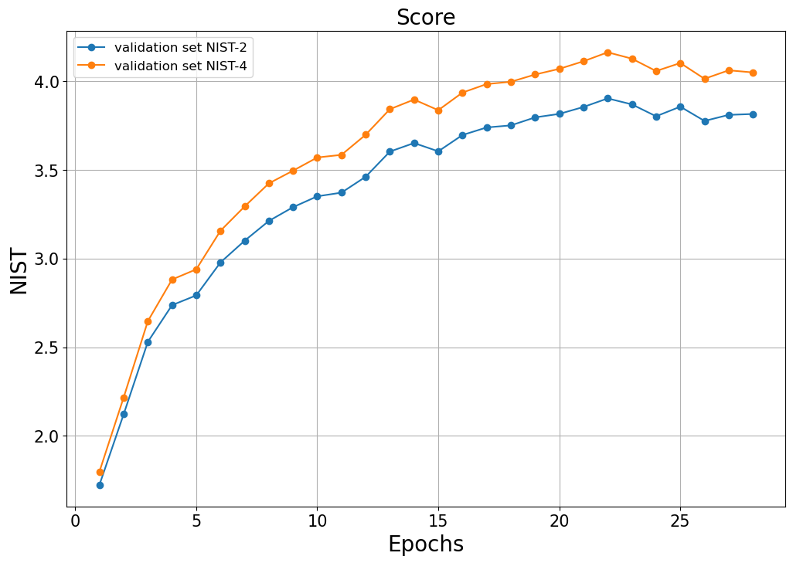<br>
    * Best NIST-2: 3.9032 (22 epoch)
    * Best NIST-4: 4.1633 (22 epoch)
    <br><br>

* Validation Set Top-5 Accuracy<br>
    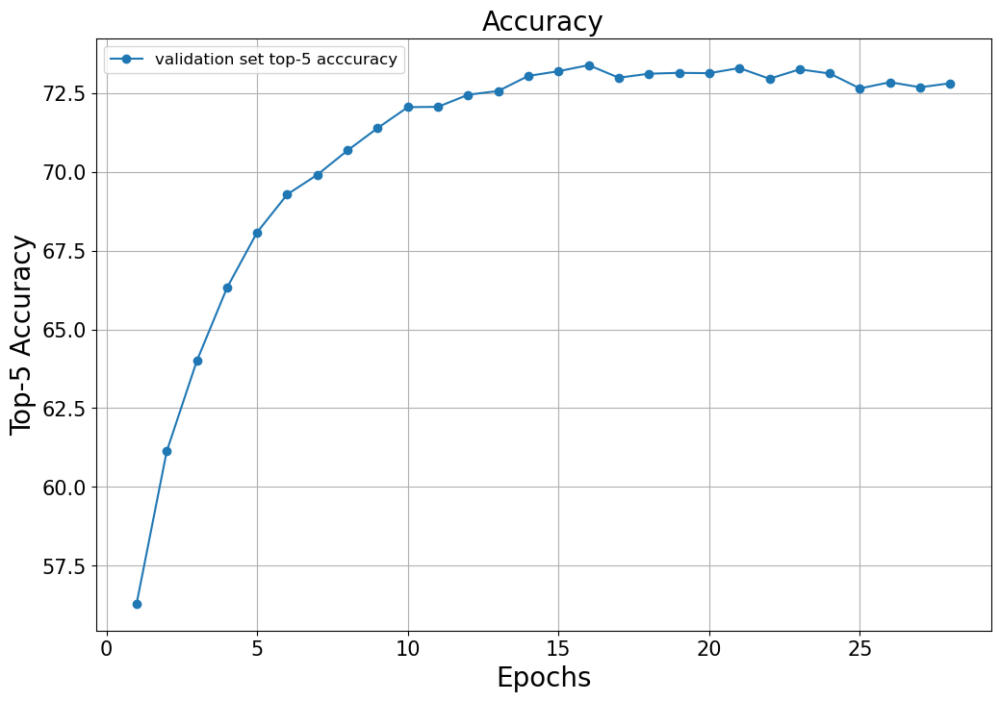<br>
    * Best top-5 accuracy: 73.3850 (16 epoch)
    <br><br>

### Real Examples
더 많은 결과는 `figs/image_captioning_model` 폴더를 참고하시기 바랍니다.
* Sample 1
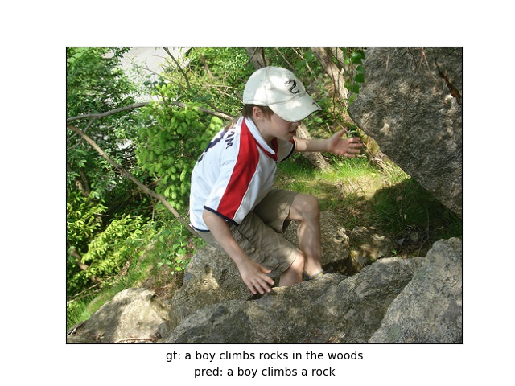<br>
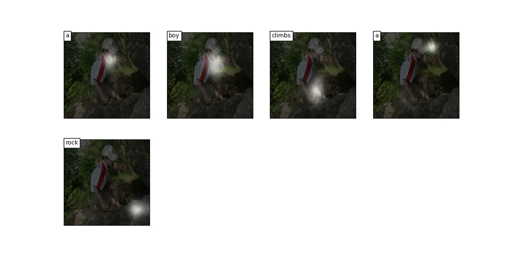<br>
<br><br>

* Sample 2
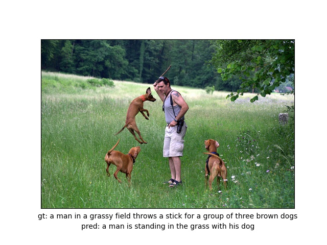<br>
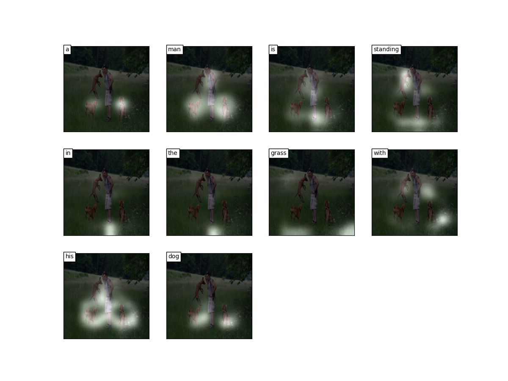<br>
<br><br>

* Sample 3
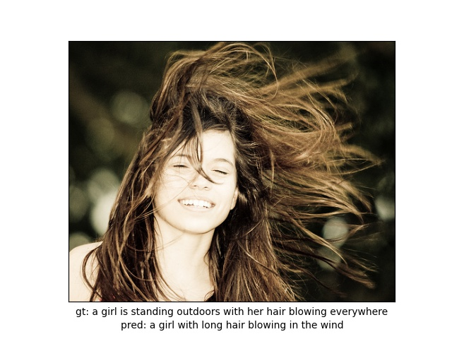<br>
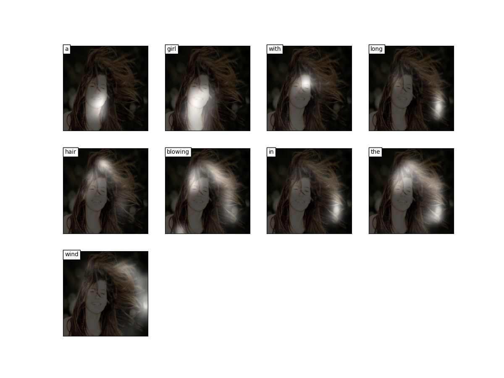<br>
<br><br>

* Sample 4
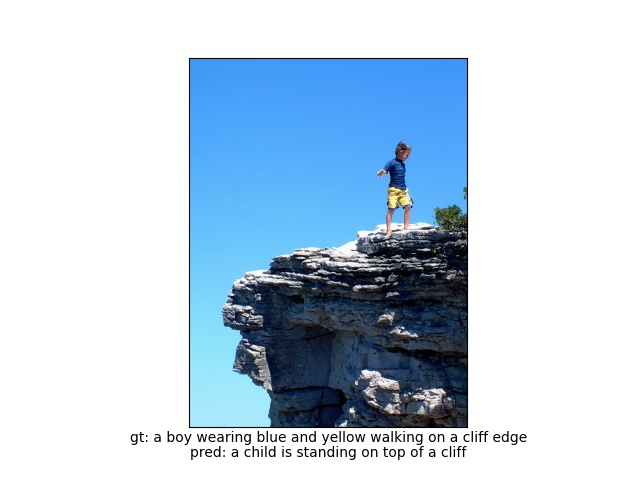<br>
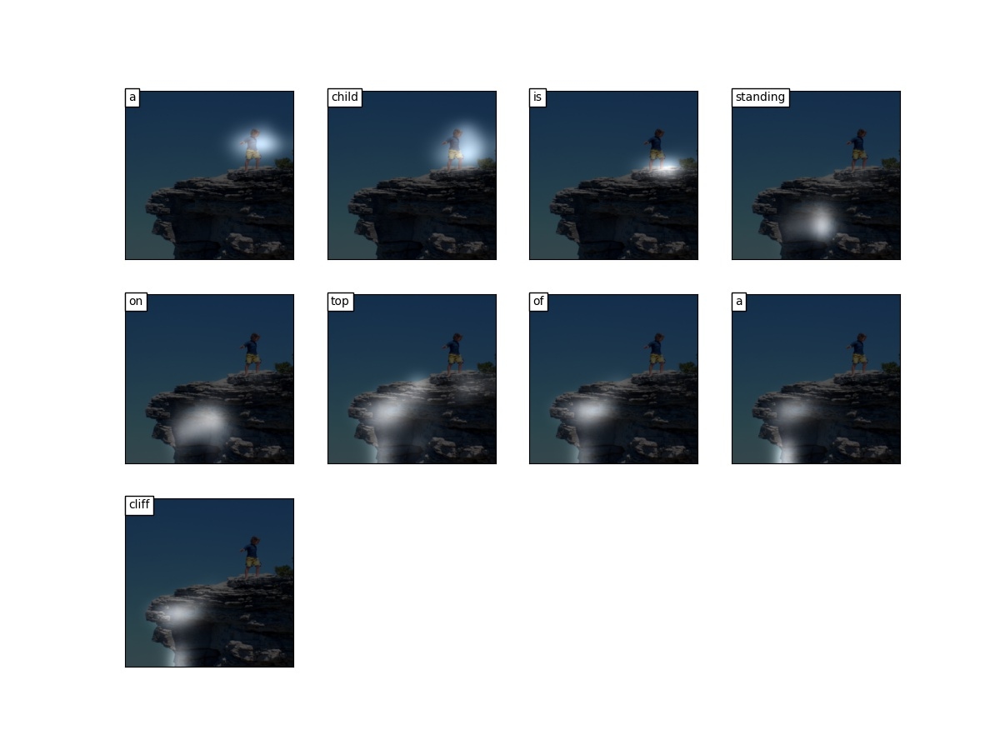<br>
<br><br>

* Sample 5
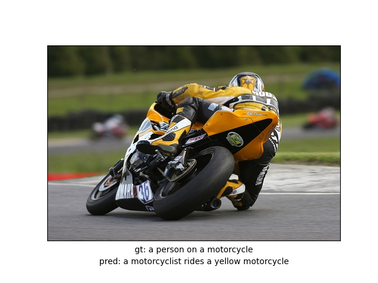<br>
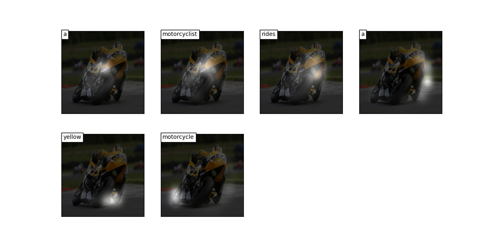<br>
<br><br>
    

<br><br><br>
